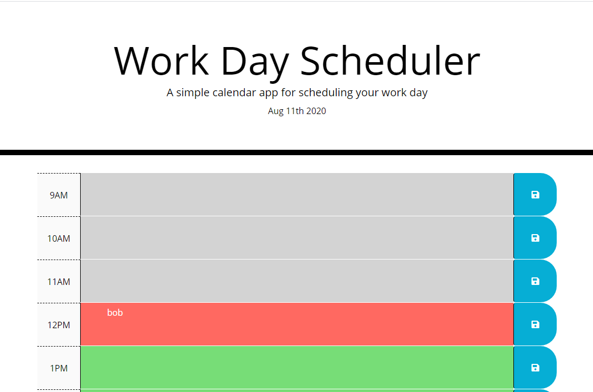

# Day-Planner

## Description

This is a day planner where the class is introduced to the fundamentals jquery.  It was difficult and chanllenging but with the help of my TA I managed to complete it and come out with a much better understanding of local storage, .on("click") events
and how useful jquery is.

## Image of site 

## Deployed Link

[Day Planner]( https://macparthum.github.io/Day_Planner/)